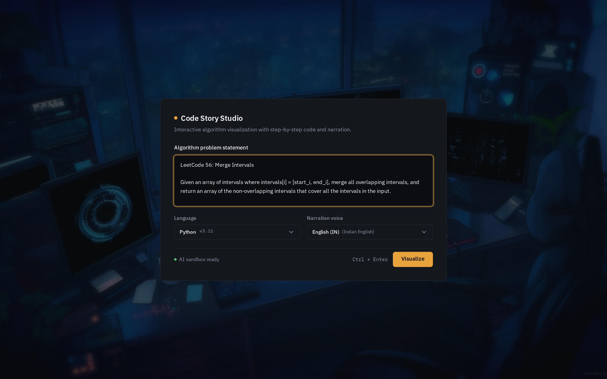
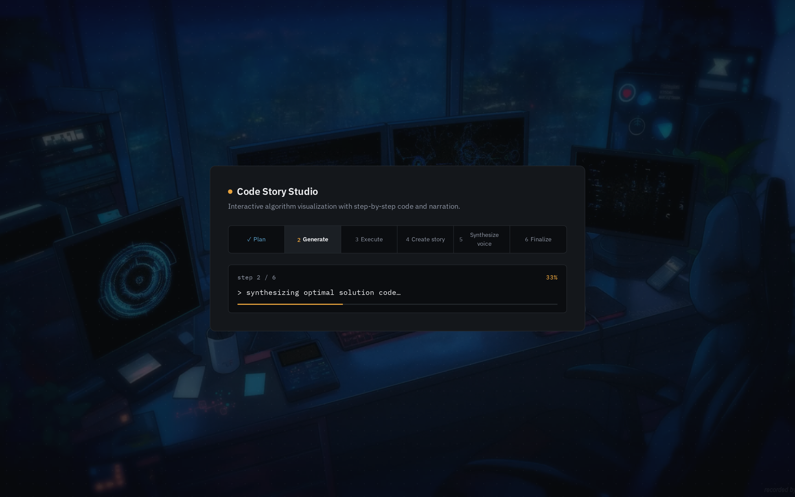
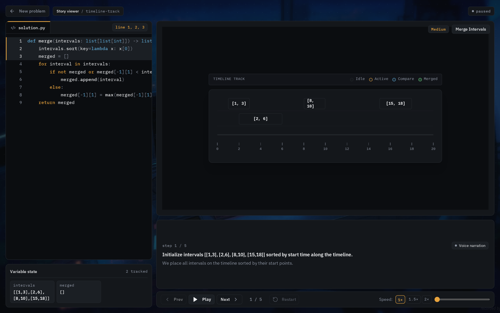
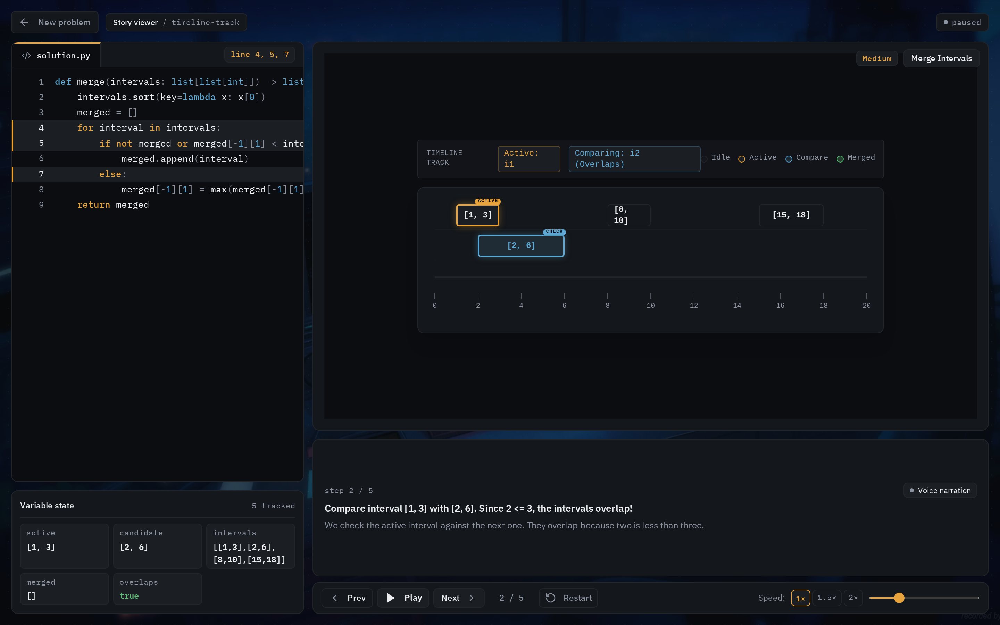
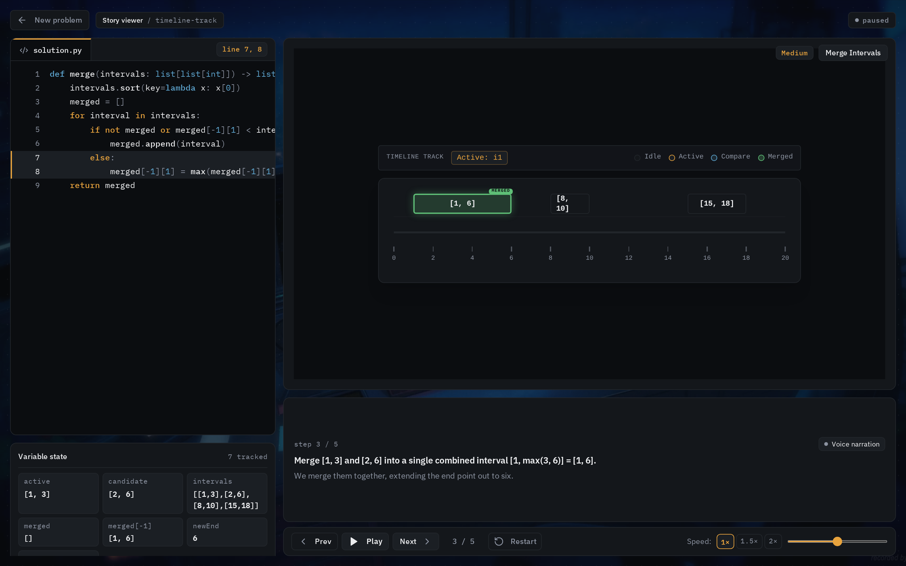

# 🎬 Code Story Studio (CodeLive)

> **Transform complex algorithms into interactive, animated stories with synchronized code execution and AI voice narration.**

[](https://react.dev/)
[](https://www.typescriptlang.org/)
[](https://vitejs.dev/)
[](https://tailwindcss.com/)
[](https://trpc.io/)
[](https://www.sarvam.ai/)

---

## 📖 Table of Contents

- [Overview](#-overview)
- [How It Works](#-how-it-works)
- [Step-by-Step Interactive Demo](#-step-by-step-interactive-demo)
  - [Step 1: Problem Input & Voice Selection](#step-1--problem-input--voice-selection)
  - [Step 2: AI Multi-Stage Synthesis Pipeline](#step-2--ai-multi-stage-synthesis-pipeline)
  - [Step 3: Algorithm Scene & Timeline Initialization](#step-3--algorithm-scene--timeline-initialization)
  - [Step 4: Synchronized Code Tracing & Live State Inspection](#step-4--synchronized-code-tracing--live-state-inspection)
  - [Step 5: Dynamic State Transition & Algorithmic Mutation](#step-5--dynamic-state-transition--algorithmic-mutation)
- [Core Features](#-core-features)
- [Visual Metaphor Scenes Library](#-visual-metaphor-scenes-library)
- [System Architecture](#-system-architecture)
- [Project Structure](#-project-structure)
- [Getting Started](#-getting-started)
  - [Prerequisites](#prerequisites)
  - [Installation](#installation)
  - [Environment Configuration](#environment-configuration)
  - [Running the App](#running-the-app)
- [Tech Stack](#-tech-stack)

---

## 🌟 Overview

**Code Story Studio** is an intelligent, visual-first algorithmic learning platform. While traditional platforms like LeetCode or HackerRank present static code and dry test cases, **Code Story Studio** bridges the conceptual gap by converting algorithmic logic into **interactive visual narratives**.

When a user submits a coding problem (e.g. *LeetCode 56: Merge Intervals*), Code Story Studio:
1. **Analyzes constraints & synthesizes clean solution code** across multiple programming languages.
2. **Executes the solution in a sandboxed runtime environment** to capture an exact execution trace and state mutation history.
3. **Generates tailored visual scene animations** (e.g., Timeline Tracks, Sorting Trays, Decision Gates, City Maps, Family Trees).
4. **Produces localized AI voice narrations** that explain the intuition behind each step in sync with code highlighting and variable inspection.

The result is a holistic learning experience where code lines, visual representations, memory state, and spoken explanations move together in lockstep.

---

## ⚡ How It Works

```
┌─────────────────────────┐
│  Problem Input (Prompt) │  --> Paste LeetCode / custom DSA problem
└────────────┬────────────┘
             │
             ▼
┌─────────────────────────┐
│   AI Synthesis Engine   │  --> Constraints analysis & optimal code generation
└────────────┬────────────┘
             │
             ▼
┌─────────────────────────┐
│ Sandboxed Execution &   │  --> Captures line-by-line runtime trace & memory state
│   Trace Recording       │
└────────────┬────────────┘
             │
             ▼
┌─────────────────────────┐
│ Scene & Story Synthesis │  --> Generates timeline tokens, badges, and visual scenes
└────────────┬────────────┘
             │
             ▼
┌─────────────────────────┐
│ Sarvam AI Voice Engine  │  --> Produces natural audio narration per step
└────────────┬────────────┘
             │
             ▼
┌─────────────────────────────────────────────────────────────┐
│                 Interactive Story Studio                     │
│  [Code Highlighting] ⟷ [Visual Canvas] ⟷ [State Inspector]  │
│                     [Audio Narration]                       │
└─────────────────────────────────────────────────────────────┘
```

---

## 📸 Step-by-Step Interactive Demo

Here is a step-by-step walkthrough of Code Story Studio running live with **LeetCode 56: Merge Intervals**.

---

### Step 1 — Problem Input & Voice Selection

Users can input any algorithmic problem statement directly into the editor card. You can configure:
- **Problem Statement**: Standard LeetCode prompts, custom competitive programming challenges, or interview questions.
- **Target Language**: Python v3.11, JavaScript, TypeScript, C++, Java, etc.
- **Narration Voice**: Multi-accent AI voice options (e.g., `English (IN)`, `English (US)`).
- **Trigger**: Click **"Visualize"** or use the keyboard shortcut `Ctrl + Enter`.



---

### Step 2 — AI Multi-Stage Synthesis Pipeline

Once triggered, the backend orchestrates a 6-stage intelligent pipeline with live feedback:
1. **Plan**: Analyzes algorithmic time/space constraints and determines optimal paradigm.
2. **Generate**: Synthesizes clean, production-grade solution code.
3. **Execute**: Runs the code in a sandboxed runtime environment and records line-by-line state variables.
4. **Create Story**: Maps variable state changes to visual action graphs and timeline scenes.
5. **Synthesize Voice**: Pre-generates natural voice narration for every scene step via Sarvam AI.
6. **Finalize**: Assembles visual assets, synchronized audio buffers, and scrubber controls.



---

### Step 3 — Algorithm Scene & Timeline Initialization

The studio loads the domain-specific visualizer (in this case, the **Timeline Track Scene**).
- **Visual Canvas**: Displays intervals `[[1, 3], [2, 6], [8, 10], [15, 18]]` placed along a calibrated numerical timeline.
- **Code Editor**: Displays clean syntax-highlighted code (`solution.py`), highlighting initial setup lines (sorting intervals by start time).
- **Variable Inspector**: Tracks live values in real time (`intervals`, `merged = []`).
- **Narration Header**: Provides step title, descriptive audio explanation, and audio playback controls.



---

### Step 4 — Synchronized Code Tracing & Live State Inspection

As you step forward through the playback:
- **Active Code Highlighting**: Executing control statements (`lines 4, 5, 7`) are highlighted dynamically.
- **Visual Highlight Badges**: The active interval `[1, 3]` is tagged with gold `ACTIVE`, while the candidate interval `[2, 6]` is tagged with cyan `CHECK`.
- **Relationship Indicators**: Scene banner clarifies status: `Active: i1 | Comparing: i2 (Overlaps)`.
- **Live Memory State**: Tracks 5 variables simultaneously (`active`, `candidate`, `intervals`, `merged`, `overlaps: true`).
- **Synchronized Audio**: Spoken narration explains why `2 <= 3` triggers the overlapping condition.



---

### Step 5 — Dynamic State Transition & Algorithmic Mutation

When state mutations take place, the canvas animates the transformation smoothly:
- **Animated Merging**: Intervals `[1, 3]` and `[2, 6]` collapse into a single expanded interval `[1, 6]` highlighted in vibrant green `MERGED`.
- **Code Line Tracking**: Highlights assignment lines `merged[-1][1] = max(merged[-1][1], interval[1])`.
- **Inspector Expansion**: Inspector tracks 7 variables including `merged[-1]: [1, 6]` and `newEnd: 6`.
- **Audio Explanation**: Voice narration articulates: *"We merge them together, extending the end point out to six."*



---

## 🎨 Core Features

- 🎯 **Multimodal Learning**: Combines visual animations, syntax-highlighted code, runtime variable inspection, and spoken audio.
- ⏱️ **Granular Playback Controls**: Full scrub bar, Step Next/Prev, Auto-Play, Restart, and adjustable playback speeds (`1x`, `1.5x`, `2x`).
- 🧠 **AI-Powered Code & Scene Generation**: Automatically deduces the best visual metaphor for any DSA problem.
- 🎙️ **Sarvam AI Voice Integration**: High-clarity speech synthesis for conceptual walkthroughs.
- 🌃 **Cyberpunk / Glassmorphic UI**: Polished dark-mode design with glowing status indicators, ambient background video, and responsive layout.
- 🛡️ **Isolated Sandboxed Execution**: Accurate execution graphs without simulation guessing.

---

## 🏛️ Visual Metaphor Scenes Library

Code Story Studio includes custom visual scenes tailored for different data structures and algorithms:

| Scene Type | Component | Targeted Data Structures & Algorithms |
|---|---|---|
| **Timeline Track** | `TimelineTrackScene.tsx` | Interval merging, scheduling, calendar conflicts, sweep line algorithms |
| **Sorting Tray** | `SortingTrayScene.tsx` | Array sorting, two-pointer comparisons, quicksort partitioning |
| **City Map** | `CityMapScene.tsx` | Graph traversals, shortest path (Dijkstra, BFS, DFS), topological sort |
| **Family Tree** | `FamilyTreeScene.tsx` | Binary trees, BST search, tree traversals (in-order, pre-order, post-order) |
| **Ledger Grid** | `LedgerGridScene.tsx` | 2D dynamic programming tables, grid pathfinding, edit distance |
| **Linked Chain** | `LinkedChainScene.tsx` | Singly/doubly linked lists, pointer reversal, cycle detection |
| **Recursion Stairs** | `RecursionStairsScene.tsx` | Call stacks, divide-and-conquer, recursion unwinding |
| **Storage Shelf** | `StorageShelfScene.tsx` | Hash maps, key-value lookup, LRU cache eviction |
| **Conveyor Loop** | `ConveyorLoopScene.tsx` | Queues, sliding window, ring buffers |
| **Decision Gate** | `DecisionGateScene.tsx` | Binary search boundaries, condition branching |

---

## 🏗️ System Architecture

```
frontend/
├── public/                         # Static assets (video background, icons)
│   ├── background.mp4
│   └── favicon.ico
├── docs/                           # Documentation and visual demo assets
│   └── screenshots/                # High-res walkthrough captures
├── src/
│   ├── components/                 # Reusable UI primitives & loaders
│   │   ├── ui/                     # Buttons, dialogs, dropdowns, tooltips
│   │   ├── AssetLoader.tsx         # Pre-decoding and media cache loader
│   │   ├── ErrorBoundary.tsx       # Safe client fallback rendering
│   │   └── LanguageSelectors.tsx   # Programming language & audio accent selectors
│   ├── contexts/                   # Shared React providers
│   │   └── ThemeContext.tsx        # Theme management
│   ├── features/                   # Feature-based modular architecture
│   │   ├── question-input/         # Problem submission & pipeline progress screen
│   │   │   ├── QuestionInputPage.tsx
│   │   │   └── useSolveQuestion.ts
│   │   └── story-viewer/           # Interactive visualizer & narration player
│   │       ├── StoryViewerPage.tsx
│   │       ├── BackgroundVideo.tsx
│   │       ├── scenes/             # 10+ visual algorithm scenes
│   │       │   ├── TimelineTrackScene.tsx
│   │       │   ├── SortingTrayScene.tsx
│   │       │   ├── CityMapScene.tsx
│   │       │   ├── FamilyTreeScene.tsx
│   │       │   ├── LedgerGridScene.tsx
│   │       │   └── SceneRenderer.tsx
│   │       └── types.ts            # Scene tokens & frame interfaces
│   ├── lib/                        # Typed client utilities & tRPC clients
│   │   ├── trpc.ts                 # tRPC React Query binding
│   │   └── languageOptions.ts      # Supported language registry
│   ├── pages/                      # Page routes
│   │   ├── StoryDemoPage.tsx       # Standalone interactive story player
│   │   └── NotFound.tsx            # 404 handler
│   ├── App.tsx                     # Router and layout composition
│   ├── main.tsx                    # Browser bootstrap
│   └── index.css                   # Tailwind v4 styles & design tokens
├── package.json
├── tsconfig.json
└── vite.config.ts
```

---

## 🚀 Getting Started

### Prerequisites

- **Node.js**: `>= 20.0.0`
- **npm** or **pnpm**: `>= 9.0.0`

### Installation

Clone the repository and install dependencies:

```bash
git clone https://github.com/ghuleaniketh/codelive.git
cd codelive
npm install
```

### Environment Configuration

Create a `.env.local` file in the project root:

```env
VITE_API_URL=http://localhost:3000
VITE_ENABLE_AUDIO=true
```

### Running the App

Start the Vite development server:

```bash
npm run dev
```

Open your browser at `http://localhost:5173`.

To build for production:

```bash
npm run build
```

To preview the production build locally:

```bash
npm run preview
```

---

## 🛠️ Tech Stack

| Category | Technologies |
|---|---|
| **Frontend Framework** | React 19, TypeScript 5.9, Vite 7 |
| **Styling & Animation** | Tailwind CSS v4, Framer Motion, Radix UI Primitives |
| **Data Fetching & API** | tRPC v11, TanStack Query v5, SuperJSON |
| **Syntax Highlighting** | React Syntax Highlighter |
| **Routing** | Wouter |
| **Audio & TTS** | Sarvam AI Text-to-Speech Engine |
| **Code Sandbox** | Judge0 / Dockerized isolated runtime |
| **Icons & Notifications**| Lucide React, Sonner |

---

## 🤝 Contributing

Contributions, feedback, and scene suggestions are welcome! Feel free to open an issue or submit a pull request.

